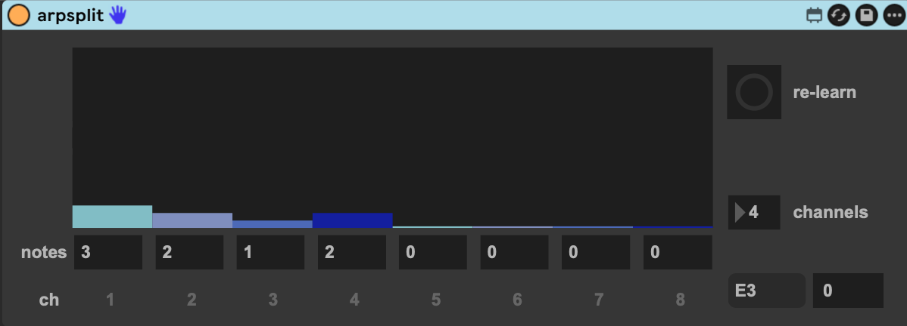

# arpsplit

A Max for Live MIDI effect that splits incoming notes across MIDI channels by
**order of first appearance** — not by pitch.

Why? So you can fan a melody, arpeggio, or chord out to several instruments
without zone-splitting by pitch. The first distinct notes go to one instrument,
the next batch to another, and so on.

**Panel legend:** **# hits** = group size per channel (how many distinct pitches
land on each — the `caps`); **Ch 1–15** = the allocation pool; **Spill** = the
overflow lane (channel 16); the **`n x n`** boxes are group size × channels feeding
**Distribute**; **Re-learn** forgets the learned order; the readout shows the last
note name and the channel it spilled to.

- Channels **1–15** are the allocation pool. Each channel holds a configurable
  number of distinct pitches (its **group size**): the first *N* new pitches go
  to channel 1, the next *M* to channel 2, etc.
- Channel **16** is the **overflow / pass-through** lane — any new pitch that
  arrives after the pool is full rides here.
- Each distinct pitch gets a stable **rank** = the order it first appeared, and
  the channel is a pure function of `(rank, group sizes)`. So the mapping is
  **deterministic and tunable**: change the group sizes and every pitch's channel
  re-derives consistently — no reset, no scramble. A given distribution always
  maps a given pitch the same way, so you can A/B distributions over a repeating
  phrase and compare cleanly. (Held notes go off on the channel they came on
  with, so changing sizes mid-note never hangs a note.)
- Pitch and velocity pass through unchanged — only the channel is chosen.

## Controls

- **caps** (list of 15 ints) — group size per channel, set directly (e.g. a
  15-bar `multislider`). `3 2 5 0 0 …` = 3 distinct pitches to ch1, 2 to ch2,
  5 to ch3, nothing to the rest. For the multislider, set Inspector **Number of
  Sliders = 15**, **Range = 0–16**, and **Output Value = integer** so the bars
  snap to whole group sizes and the Distribute echo displays cleanly.
- **groupsize** + **channels** + **distribute** — the quick path: set a per-
  channel count and how many channels to use, hit **distribute**, and it fills
  the first *channels* channels with *groupsize* each (the rest 0). The new caps
  are echoed back to the multislider so the UI stays in sync.
Changing the distribution (dragging the multislider or hitting **Distribute**)
just **re-derives** every pitch's channel from its rank — instantly, consistently,
and without disrupting the comparison. There is no per-note reset.

- **Re-learn** — forget all learned ranks; the next distinct pitches start ranking
  from 0 again. Use this when you switch to a genuinely different *pattern* (not
  for tuning the distribution). Held notes keep playing and still get a clean
  note-off, so re-learning mid-phrase never hangs a note.

## Routing in Ableton Live

arpsplit assigns each note a group 1–16 and emits it two ways at once, so pick
the path that matches your setup. **Important:** Live flattens MIDI to one
channel per track on output and offers no channel filter on track-to-track
routing — so you *cannot* split to separate tracks by MIDI channel. Use one of:

### A. One multitimbral instrument (same track) — uses MIDI channels

If a single multitimbral instrument (Kontakt, Omnisphere, Reaktor, or an
External Instrument to a hardware/IAC port) sits **after arpsplit on the same
track**, it receives all 16 channels directly — Live only collapses channels
*between* tracks, not within a track's own device chain. Just set the instrument
to respond per-channel. Channel = group (16 = overflow). Nothing else to wire.

### B. Separate tracks — uses the `send`/`receive` buses

arpsplit also broadcasts each group to a global send bus `arpsplit_ch1..16`.
The companion **arpsplit-recv** device receives one bus and outputs it locally,
sidestepping Live's channel limit entirely:

1. Put **arpsplit** on a MIDI track (no instrument needed; it's the master).
2. On each instrument track, add **arpsplit-recv** *before* the instrument and
   set its **Group** to the bus you want (1–15 = pool, 16 = overflow).
3. That track now plays only its group. No MIDI From routing, no IAC.

The bus names are **global**, so run **one arpsplit master per Live set**.
Only notes travel the buses; CC/pitch-bend/etc. stay on the master track
(path A still carries them per-channel).

## Install

Requires Ableton Live with Max for Live.

1. Download **`arpsplit.amxd`** (and **`arpsplit-recv.amxd`** if you want to fan
   out to separate tracks — see path B below). Either grab them from the
   [latest release](../../releases) or download the raw files from this repo.
2. Drop **`arpsplit.amxd`** onto a MIDI track in Live.
3. Route it to your instrument(s) using one of the two paths above.

The `.amxd` files are frozen (self-contained) — no other files needed to run them.

## Development

Logic lives in the abstraction + the v8 script; the `.amxd` is a thin shell with
the front-panel UI (multislider, number boxes, distribute button, in/out
displays).

- `arpsplit.js` — the brain: stable pitch→rank map + `channelForRank()` derivation
  (a `v8` object). Single inlet takes note pairs and config messages
  (`caps …`, `groupsize $1`, `channels $1`, `distribute`, `relearn`/`bang`).
  Tuning caps re-derives channels without clearing ranks.
- `arpsplit.maxpat` — MIDI plumbing: `midiparse → v8 → midiformat`, channel set
  on midiformat's right inlet before each note; also `v8 → route → send
  arpsplit_ch1..16` to broadcast each group. Inlets: `0` MIDI, `1` caps,
  `2` distribute, `3` groupsize, `4` channels, `5` re-learn.
- `arpsplit-recv.maxpat` — receiver: 16 `receive arpsplit_chN` → `switch 16`
  (Group selects the open bus) → `midiformat` → MIDI out.
- `caps_labels.maxpat` — paste-in fragment: `unpack` + 15 number boxes spaced to
  sit under the multislider as per-channel value labels.
- `validate_maxpat.mjs` — structural check: `node validate_maxpat.mjs <file>.maxpat`

To rebuild a device, edit the loose source files (keep them beside the `.amxd`),
then in Live's Max editor **Freeze (snowflake) → Save** to re-embed them.

### Notes / limitations (v1)

- Only **note** messages are split. Poly-aftertouch, CC, program change,
  channel-aftertouch and pitch-bend pass straight through; their channel follows
  the last note's channel rather than being duplicated per destination.
- Changing the distribution (**caps** or **Distribute**) re-derives channels from
  ranks; it does not clear ranks. Use **Re-learn** (inlet 5 / `relearn` message)
  to forget ranks when you switch to a genuinely different pattern.
- `arpsplit.js` uses the `v8` object (Max 8.5+). Swap to `js` if targeting older
  Max, but the script uses only ES5-safe constructs either way.
